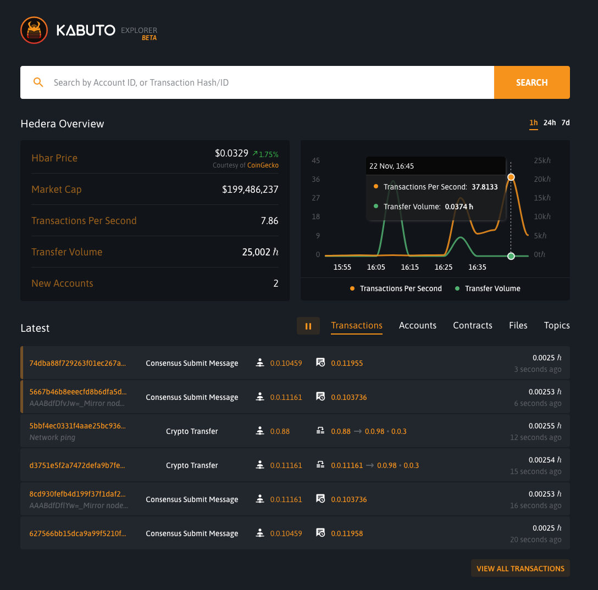

# Trust Enterprises transactions per second (TPS) benchmark

Evidence of benchmarking free serverless Trust Enterprise clients on Hedera Hashgraph testnet.

These following benchmarks are using a single Trust Enterprises API client directly. This process is unoptimised whereby our vercel account is free and we aren't distributing the request to multiple clients.

There are limits with the free Vercel deployment but the client is still capable of sending **40-50+ TPS** to the Hedera Hashgraph network. We'll be exploring TPS benchmarking on other platforms.

Please note, the **api-key** has been removed.

## Try for yourself

1. Check out the [docs](https://docs.trust.enterprises) to create your Trust Enterprises client
2. Create a new topic through the API, use [postman](https://www.getpostman.com/run-collection/e61a0c42e7d572890996) if you can.
3. Modify, tweak and use the curl command below.

## The synthetic benchmark

Feel free to tweak the below figures, you can hit **30-40 TPS** range fairly quickly.

- 10000 requests
- 50 parallel requests

```
seq 1 10000 | xargs -n1 -P50 curl --location --request POST 'https://test-hedera-deployment-i30ee09bg.vercel.app/api/consensus/message/' \
--header 'x-api-key: xxxxxxxxxsecretxxxxxxxxxx' \
--header 'Content-Type: application/x-www-form-urlencoded' \
--data-urlencode 'message=tps message test' \
--data-urlencode 'topic_id=77484'
```

In the image below proves the client being able to hit **37 TPS** if you look at the blog post by DOVU [Introducing Proof of Carbon on Hedera Hashgraph](https://blog.dovu.dev/introducing-proof-of-carbon/) the TPS for the DOVU client hits **50**.



It goes without saying that stability and reliability of requests to your client should be far lower in production.
